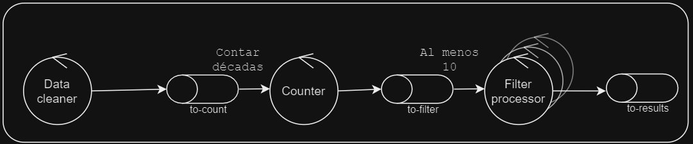

# Trabajo Practico 1: Escalabilidad

## Integrantes:
* Harriet Eliana
* Godoy Dupont Mateo

La documentación del proyecto se realizará utilizando la arquitectura de 4+1 views. Para ello, iremos explicando vista por vista los distintos diagramas con el fin de describir todos los aspectos del proyecto. 

**Idea del sistema:**

Cada query necesita que el flujo pase por distintos procesadores de datos. A continuación los mostramos:

Query 1:

Query 2:

### Vista de Escenarios

El diagrama de casos de uso muestra las distintas interacciones que puede tener el usuario con nuestro sistema. En primer lugar, el usuario puede iniciar el sistema para que comience a hacer el análisis de los datos. Una vez que el sistema comienza a correr, el usuario puede ir constatando el archivo de resultados que se va generando en su computadora. (El sistema no se cerrará hasta completar el análisis).  

### Vista Lógica

### Vista de Desarrollo
 
### Vista de Procesos

### Vista Física

Uno de los objetivos de nuestro sistema es lograr un procesamiento distribuido de la información, para ello planteamos que cada uno de los distintos componentes del sistema puede ser ejecutado de forma independiente. Una de las formas de lograr cumplir esta meta es tener a cada nodo en un container propio que se conecte con el resto del sistema mediante nuestro middleware. Algunos de estos nodos pueden levantarse múltiples veces a fin de agilizar el proceso.